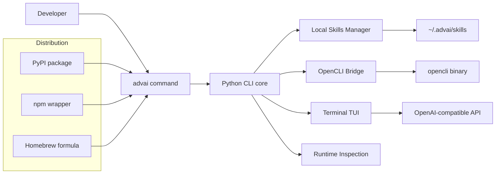

<p align="center">
  
</p>

<h1 align="center">advai-cli</h1>

<p align="center">
  A unified CLI for local skills, external CLIs, and terminal AI chat.
</p>

<p align="center">
  <a href="https://github.com/Advai-X/advai-cli/actions/workflows/ci.yml"></a>
  <a href="https://pypi.org/project/advai-cli/"></a>
  <a href="https://www.npmjs.com/package/advai-cli"></a>
  <a href="https://pypi.org/project/advai-cli/"></a>
  <a href="LICENSE"></a>
  <a href="https://github.com/Advai-X/advai-cli/stargazers"></a>
  <a href="https://github.com/Advai-X/advai-cli/issues"></a>
</p>

<p align="center">
  <a href="#why-advai-cli">Why</a> •
  <a href="#installation">Installation</a> •
  <a href="#quick-start">Quick Start</a> •
  <a href="#common-commands">Commands</a> •
  <a href="#ai-tui">AI TUI</a> •
  <a href="#development">Development</a>
</p>

`advai-cli` is a unified command-line interface for managing local skills, working with external CLIs, and chatting with AI from the terminal through a single `advai` entrypoint.

It is designed as a lightweight Python-first core with npm and Homebrew distribution options, making it easy to install in different developer environments while keeping the runtime model simple and predictable.

## Why advai-cli

- One entrypoint for runtime inspection, local skill management, external CLI workflows, and terminal-native AI chat
- Python core for a small, dependency-light implementation
- npm wrapper for teams that prefer JavaScript-based distribution
- Homebrew formula for macOS-friendly installation
- OpenAI-compatible backend support for flexible AI provider integration
- Local-first state stored under `~/.advai`

## Highlights

- Inspect the current installation, runtime, and recommended update command with `advai info` and `advai update`
- Manage locally installed skills with install, list, info, update, and uninstall commands
- Sync installed skills into platform-specific agent directories such as Cursor, Claude Code, Codex, TRAE, and more
- Discover and install supported third-party CLIs through the OpenCLI ecosystem
- Create local knowledge bases, add documents, search content, and resync from source files
- Proxy supported external CLIs through `advai cli <name> ...`
- Launch a terminal chat UI with configurable model, base URL, system prompt, and transcript export

## Architecture



## Installation

### Requirements

- Python `3.8+`
- Node.js `14+` only if you install through npm
- A local Python runtime is still required when using the npm package
- `opencli` is required only for external CLI discovery, install, and passthrough execution

### Install from PyPI

```bash
pip install advai-cli
```

### Install from npm

```bash
npm install -g advai-cli
```

### Install from Homebrew

```bash
brew install Advai-X/advai-cli/advai-cli
```

### Install with the bootstrap script

```bash
./install.sh
```

## Quick Start

### 1. Verify the installation

```bash
advai --help
advai info
```

### 2. Configure AI access

```bash
export ADVAI_API_KEY=your_api_key
```

### 3. Start the terminal chat UI

```bash
advai tui
```

### 4. Explore local skills and external CLIs

```bash
advai skill list
advai cli list
```

## Common Commands

These are the canonical commands to use in docs, screenshots, and promotional assets:

```bash
advai info
advai skill list
advai cli list
advai tui
```

| Command | Description |
| --- | --- |
| `advai --help` | Show the main command help |
| `advai info` | Show runtime, installation, and environment details |
| `advai update` | Print the recommended update command for the current install method |
| `advai tui` | Start the terminal AI chat interface |
| `advai skill list` | List locally installed skills |
| `advai skill info <name>` | Show local metadata for a skill |
| `advai skill install <github-url> [--skill <name>]` | Install skill definitions from a GitHub repo |
| `advai skill install <github-url> --platform <key>` | Install and sync a skill to one or more target platforms |
| `advai skill update [name]` | Refresh one or all installed skills |
| `advai skill uninstall <name>` | Remove an installed skill |
| `advai skill sync <name> --platform <key>` | Sync an installed skill into one or more platform skills directories |
| `advai skill unsync <name> --platform <key>` | Remove synced platform targets for a skill |
| `advai skill platform list` | List built-in and custom skill platforms |
| `advai skill platform add <key> --name <name> --path <dir>` | Register a custom skill platform |
| `advai skill platform override <key> --path <dir>` | Override a platform skills directory |
| `advai skill platform clear-override <key>` | Reset platform path overrides |
| `advai cli list` | List installable external CLIs from OpenCLI |
| `advai cli info <name>` | Show details for an external CLI |
| `advai cli install <github-url> [--cli <name>]` | Register external CLI definitions from a GitHub repo |
| `advai cli update <name> --yes` | Update an external CLI without confirmation |
| `advai cli uninstall <name> --yes` | Uninstall an external CLI without confirmation |
| `advai cli <name> ...` | Execute a supported external CLI through `advai` |
| `advai kb create <name>` | Create a local knowledge base |
| `advai kb doc add <name> <path>` | Copy a document into a knowledge base |
| `advai kb search <name> <query>` | Search stored knowledge base documents |
| `advai kb sync <name>` | Refresh stored documents from their source files |

## AI TUI

The TUI connects to any OpenAI-compatible `/chat/completions` backend and runs entirely inside the terminal.

### Useful examples

```bash
advai tui
advai tui --agent default
advai tui --model gpt-4o-mini
advai tui --base-url https://api.openai.com/v1
advai tui --system-prompt "You are a concise terminal coding assistant."
advai tui --timeout 180
```

### Environment variables

`advai-cli` supports both `ADVAI_*` and part of the standard `OPENAI_*` naming for compatibility.

| Variable | Required | Default | Description |
| --- | --- | --- | --- |
| `ADVAI_API_KEY` | Yes* | none | API key for the AI backend |
| `ADVAI_BASE_URL` | No | `https://api.openai.com/v1` | Base URL for an OpenAI-compatible API |
| `ADVAI_AGENT` | No | `default` | Default agent used by `advai tui` |
| `ADVAI_AGENTS` | No | `default` | Comma-separated agents shown by the interactive `/agent` picker |
| `ADVAI_MODEL` | No | `gpt-4o-mini` | Default model used by `advai tui` |
| `ADVAI_MODELS` | No | built-in model list | Comma-separated models shown by the interactive `/model` picker |
| `ADVAI_SYSTEM_PROMPT` | No | built-in prompt | Initial system prompt |
| `ADVAI_TIMEOUT` | No | `120` | Request timeout in seconds |
| `OPENAI_API_KEY` | Yes* | none | Fallback if `ADVAI_API_KEY` is not set |
| `OPENAI_BASE_URL` | No | none | Fallback if `ADVAI_BASE_URL` is not set |
| `OPENAI_MODEL` | No | none | Fallback if `ADVAI_MODEL` is not set |

\* `ADVAI_API_KEY` or `OPENAI_API_KEY` must be set before running `advai tui`.

### In-session TUI commands

```bash
/help
/clear
/agent
/agent default
/model
/model gpt-4o-mini
/system You are a helpful assistant.
/save ./chat.md
/exit
```

Run `/agent` with no arguments to open an interactive agent picker.
Run `/model` with no arguments to open an interactive model picker. Use the up and down arrow keys to choose a model, then press Enter to confirm.

## Skills

Skills are stored locally under `~/.advai/skills`.

```bash
advai skill list
advai skill platform list
advai skill info demo-skill
advai skill install https://github.com/your-org/skill-repo
advai skill install https://github.com/your-org/skill-repo --skill demo-skill
advai skill install https://github.com/your-org/skill-repo --skill demo-skill --platform cursor
advai skill sync demo-skill --platform trae
advai skill sync demo-skill --platform omp_agent --project-dir /path/to/repo
advai skill unsync demo-skill --platform cursor
advai skill platform add custom_agent --name "Custom Agent" --path ~/.custom-agent/skills
advai skill platform override cursor --path ~/.cursor/skills
advai skill update demo-skill
advai skill uninstall demo-skill
```

### Supported platforms

`advai skill sync --platform <key>` currently includes `51` built-in platform adapters, plus custom platform support through `advai skill platform add`.

#### Coding platforms

| Key | Platform |
| --- | --- |
| `adal` | AdaL |
| `amp` | Amp |
| `antigravity` | Antigravity |
| `augment` | Augment |
| `bob` | IBM Bob |
| `claude_code` | Claude Code |
| `cline` | Cline |
| `codebuddy` | CodeBuddy |
| `codex` | Codex |
| `command_code` | Command Code |
| `continue` | Continue |
| `cortex` | Cortex Code |
| `crush` | Crush |
| `cursor` | Cursor |
| `deepagents` | Deep Agents |
| `droid` | Droid |
| `firebender` | Firebender |
| `gemini_cli` | Gemini CLI |
| `github_copilot` | GitHub Copilot |
| `goose` | Goose |
| `grok` | Grok |
| `iflow` | iFlow CLI |
| `junie` | Junie |
| `kilo_code` | Kilo Code |
| `kimi` | Kimi Code CLI |
| `kiro` | Kiro CLI |
| `kode` | Kode |
| `mcpjam` | MCPJam |
| `mistral_vibe` | Mistral Vibe |
| `mux` | Mux |
| `neovate` | Neovate |
| `omp_agent` | OMP Agent |
| `openhands` | OpenHands |
| `opencode` | OpenCode |
| `pi` | Pi |
| `pochi` | Pochi |
| `qoder` | Qoder |
| `qwen_code` | Qwen Code |
| `replit` | Replit |
| `roo_code` | Roo Code |
| `trae` | TRAE IDE |
| `trae_cn` | TRAE CN |
| `warp` | Warp |
| `windsurf` | Windsurf |
| `zencoder` | Zencoder |

#### Lobster platforms

| Key | Platform |
| --- | --- |
| `autoclaw` | AutoClaw |
| `easyclaw` | EasyClaw |
| `hermes` | Hermes Agent |
| `openclaw` | OpenClaw |
| `qclaw` | QClaw |
| `workbuddy` | WorkBuddy |

#### Custom platforms

- Use `advai skill platform add <key> --name <name> --path <dir>` to register any additional agent or internal platform that stores skills on disk.
- Use `advai skill platform override <key> --path <dir>` or `--project-path <dir>` to adapt built-in platform paths to your local setup.

Current scope:

- GitHub installs read from the repository root `skills/` directory instead of copying the whole repo
- If the repo `skills/` directory contains one skill, `advai` installs it automatically
- If the repo `skills/` directory contains multiple skills, `advai` prompts whether to install all of them; use `--skill <name>` to choose one explicitly
- `advai skill update <name>` reuses the saved GitHub repo URL and selected skill directory when the installed skill came from GitHub
- `advai skill install` and `advai cli install` currently support GitHub repository URLs only
- Built-in platform adapters cover common coding and lobster-style agents, and custom platforms can be added locally
- `advai skill sync` supports `symlink` and `copy` modes for writing skills into platform-specific directories
- `advai skill install <github-url> --platform <key>` installs locally first, then syncs into each selected platform
- `advai skill uninstall <name>` removes the local skill and cleans up any synced platform targets recorded in metadata
- Platforms with project-local skills directories can be targeted with `--project-dir`

## External CLI Integration

External CLI support is powered by `opencli`.

```bash
advai cli list
advai cli info demo-cli
advai cli install https://github.com/your-org/cli-repo
advai cli install https://github.com/your-org/cli-repo --cli demo-cli
advai cli update demo-cli --yes
advai cli uninstall demo-cli --yes
advai cli demo-cli --help
```

Notes:

- `advai cli list`, `advai cli info`, `advai cli install`, `advai cli update`, and `advai cli uninstall` require `opencli` to be installed and available on `PATH`
- GitHub CLI installs read from the repository root `clis/` directory and register each selected CLI via `opencli external register`
- If the repo `clis/` directory contains multiple CLIs, `advai` prompts whether to install all of them; use `--cli <name>` to choose one explicitly
- Dynamic passthrough execution works only for CLIs exposed by the local OpenCLI registry
- `advai-cli` does not reimplement third-party CLIs; it provides a consistent entrypoint and installation surface

## Knowledge Bases

Knowledge bases are stored locally under `~/.advai/kbs`.

`advai kb` is also designed to be OKF-friendly. Based on the Open Knowledge Format (OKF) direction described by Google Cloud, the current implementation already works well with knowledge bundles that are organized as markdown files on disk, including files that contain YAML frontmatter.

```bash
advai kb create team-wiki
advai kb doc add team-wiki ./README.md
advai kb search team-wiki homebrew
advai kb sync team-wiki
```

Current scope:

- `advai kb create <name>` initializes a local knowledge base directory and metadata file
- `advai kb doc add <name> <path>` copies a source document into the knowledge base and tracks its original path
- `advai kb search <name> <query>` performs a simple case-insensitive text search over stored document content
- `advai kb sync <name>` refreshes stored copies from the original source paths and reports any missing files
- OKF-friendly ingestion: markdown-based knowledge docs can be added directly without conversion
- YAML frontmatter is preserved as plain text, so OKF metadata remains searchable and does not get stripped during add or sync
- This version does not yet implement full OKF-aware parsing, validation, or structured metadata querying; it focuses on filesystem-native storage and simple text retrieval first

## Project Structure

```text
advai/
  ai_client.py      OpenAI-compatible HTTP client
  cli.py            Main CLI entrypoint
  cli_manager.py    Install detection, update commands, OpenCLI integration
  kb.py             Local knowledge base storage and search helpers
  skill_platforms.py Platform adapter registry and path resolution
  skills.py         Local skill metadata management
  tui.py            Terminal chat UI
bin/
  advai.js          npm bridge that forwards execution to Python
  check-python.js   npm postinstall Python check
docs/
  assets/
    hero.png        README hero image
Formula/
  advai-cli.rb      Homebrew formula
install.sh          Bootstrap installer
```

## Development

### Run from source

```bash
python -m venv .venv
source .venv/bin/activate
pip install -e .
advai --help
python -m advai.cli info
```

### Packaging model

- PyPI ships the Python implementation directly
- npm publishes a thin wrapper that locates Python and forwards to the Python CLI
- Homebrew installs the Python package through a formula-managed virtual environment

## Operational Notes

- Local state lives under `~/.advai`
- Knowledge bases are stored under `~/.advai/kbs`
- Skills are stored under `~/.advai/skills`
- The recommended self-update command changes depending on whether the tool was installed via `pip`, `npm`, or `brew`
- npm installation checks for a working Python interpreter during `postinstall`

## License

MIT
