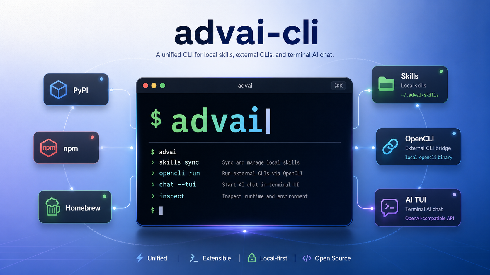
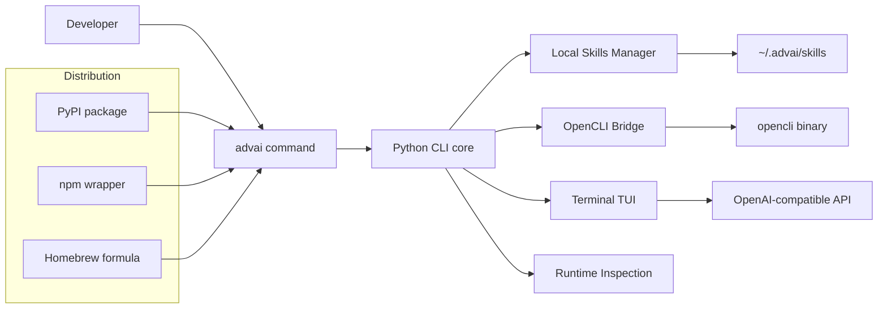

<p align="center">
  
</p>

<h1 align="center">advai-cli</h1>

<p align="center">
  A unified CLI for local skills, external CLIs, and terminal AI chat.
</p>

<p align="center">
  <a href="https://pypi.org/project/advai-cli/"></a>
  <a href="https://www.npmjs.com/package/advai-cli"></a>
  <a href="https://pypi.org/project/advai-cli/"></a>
  <a href="LICENSE"></a>
  <a href="https://github.com/Advai-X/advai-x-cli/stargazers"></a>
  <a href="https://github.com/Advai-X/advai-x-cli/issues"></a>
</p>

<p align="center">
  <a href="#why-advai-cli">Why</a> •
  <a href="#installation">Installation</a> •
  <a href="#quick-start">Quick Start</a> •
  <a href="#common-commands">Commands</a> •
  <a href="#ai-tui">AI TUI</a> •
  <a href="#development">Development</a>
</p>

`advai-cli` is a unified command-line interface for managing local skills, working with external CLIs, and chatting with AI from the terminal through a single `advai` entrypoint.

It is designed as a lightweight Python-first core with npm and Homebrew distribution options, making it easy to install in different developer environments while keeping the runtime model simple and predictable.

## Why advai-cli

- One entrypoint for runtime inspection, local skill management, external CLI workflows, and terminal-native AI chat
- Python core for a small, dependency-light implementation
- npm wrapper for teams that prefer JavaScript-based distribution
- Homebrew formula for macOS-friendly installation
- OpenAI-compatible backend support for flexible AI provider integration
- Local-first state stored under `~/.advai`

## Highlights

- Inspect the current installation, runtime, and recommended update command with `advai info` and `advai update`
- Manage locally installed skills with install, list, info, update, and uninstall commands
- Discover and install supported third-party CLIs through the OpenCLI ecosystem
- Proxy supported external CLIs through `advai cli <name> ...`
- Launch a terminal chat UI with configurable model, base URL, system prompt, and transcript export

## Architecture



## Installation

### Requirements

- Python `3.8+`
- Node.js `14+` only if you install through npm
- A local Python runtime is still required when using the npm package
- `opencli` is required only for external CLI discovery, install, and passthrough execution

### Install from PyPI

```bash
pip install advai-cli
```

### Install from npm

```bash
npm install -g advai-cli
```

### Install from Homebrew

```bash
brew install Advai-X/advai-x-cli/advai-cli
```

### Install with the bootstrap script

```bash
./install.sh
```

## Quick Start

### 1. Verify the installation

```bash
advai --help
advai info
```

### 2. Configure AI access

```bash
export ADVAI_API_KEY=your_api_key
```

### 3. Start the terminal chat UI

```bash
advai tui
```

### 4. Explore local skills and external CLIs

```bash
advai skill list
advai cli list
```

## Common Commands

These are the canonical commands to use in docs, screenshots, and promotional assets:

```bash
advai info
advai skill list
advai cli list
advai tui
```

| Command | Description |
| --- | --- |
| `advai --help` | Show the main command help |
| `advai info` | Show runtime, installation, and environment details |
| `advai update` | Print the recommended update command for the current install method |
| `advai tui` | Start the terminal AI chat interface |
| `advai skill list` | List locally installed skills |
| `advai skill info <name>` | Show local metadata for a skill |
| `advai skill install <name>` | Install a local skill entry |
| `advai skill update [name]` | Refresh one or all installed skills |
| `advai skill uninstall <name>` | Remove an installed skill |
| `advai cli list` | List installable external CLIs from OpenCLI |
| `advai cli info <name>` | Show details for an external CLI |
| `advai cli install <name> --yes` | Install an external CLI without confirmation |
| `advai cli <name> ...` | Execute a supported external CLI through `advai` |

## AI TUI

The TUI connects to any OpenAI-compatible `/chat/completions` backend and runs entirely inside the terminal.

### Useful examples

```bash
advai tui
advai tui --agent default
advai tui --model gpt-4o-mini
advai tui --base-url https://api.openai.com/v1
advai tui --system-prompt "You are a concise terminal coding assistant."
advai tui --timeout 180
```

### Environment variables

`advai-cli` supports both `ADVAI_*` and part of the standard `OPENAI_*` naming for compatibility.

| Variable | Required | Default | Description |
| --- | --- | --- | --- |
| `ADVAI_API_KEY` | Yes* | none | API key for the AI backend |
| `ADVAI_BASE_URL` | No | `https://api.openai.com/v1` | Base URL for an OpenAI-compatible API |
| `ADVAI_AGENT` | No | `default` | Default agent used by `advai tui` |
| `ADVAI_AGENTS` | No | `default` | Comma-separated agents shown by the interactive `/agent` picker |
| `ADVAI_MODEL` | No | `gpt-4o-mini` | Default model used by `advai tui` |
| `ADVAI_MODELS` | No | built-in model list | Comma-separated models shown by the interactive `/model` picker |
| `ADVAI_SYSTEM_PROMPT` | No | built-in prompt | Initial system prompt |
| `ADVAI_TIMEOUT` | No | `120` | Request timeout in seconds |
| `OPENAI_API_KEY` | Yes* | none | Fallback if `ADVAI_API_KEY` is not set |
| `OPENAI_BASE_URL` | No | none | Fallback if `ADVAI_BASE_URL` is not set |
| `OPENAI_MODEL` | No | none | Fallback if `ADVAI_MODEL` is not set |

\* `ADVAI_API_KEY` or `OPENAI_API_KEY` must be set before running `advai tui`.

### In-session TUI commands

```bash
/help
/clear
/agent
/agent default
/model
/model gpt-4o-mini
/system You are a helpful assistant.
/save ./chat.md
/exit
```

Run `/agent` with no arguments to open an interactive agent picker.
Run `/model` with no arguments to open an interactive model picker. Use the up and down arrow keys to choose a model, then press Enter to confirm.

## Skills

Skills are stored locally under `~/.advai/skills`.

```bash
advai skill list
advai skill info demo-skill
advai skill install demo-skill
advai skill update demo-skill
advai skill uninstall demo-skill
```

Current scope:

- Skill installation and update currently manage local metadata and directory lifecycle
- This keeps the implementation lightweight and leaves room for future remote registry or download workflows

## External CLI Integration

External CLI support is powered by `opencli`.

```bash
advai cli list
advai cli info demo-cli
advai cli install demo-cli --yes
advai cli demo-cli --help
```

Notes:

- `advai cli list`, `advai cli info`, and `advai cli install` require `opencli` to be installed and available on `PATH`
- Dynamic passthrough execution works only for CLIs exposed by the local OpenCLI registry
- `advai-cli` does not reimplement third-party CLIs; it provides a consistent entrypoint and installation surface

## Project Structure

```text
advai/
  ai_client.py      OpenAI-compatible HTTP client
  cli.py            Main CLI entrypoint
  cli_manager.py    Install detection, update commands, OpenCLI integration
  skills.py         Local skill metadata management
  tui.py            Terminal chat UI
bin/
  advai.js          npm bridge that forwards execution to Python
  check-python.js   npm postinstall Python check
docs/
  assets/
    hero.png        README hero image
Formula/
  advai-cli.rb      Homebrew formula
install.sh          Bootstrap installer
```

## Development

### Run from source

```bash
python -m venv .venv
source .venv/bin/activate
pip install -e .
advai --help
python -m advai.cli info
```

### Packaging model

- PyPI ships the Python implementation directly
- npm publishes a thin wrapper that locates Python and forwards to the Python CLI
- Homebrew installs the Python package through a formula-managed virtual environment

## Operational Notes

- Local state lives under `~/.advai`
- Skills are stored under `~/.advai/skills`
- The recommended self-update command changes depending on whether the tool was installed via `pip`, `npm`, or `brew`
- npm installation checks for a working Python interpreter during `postinstall`

## License

MIT
